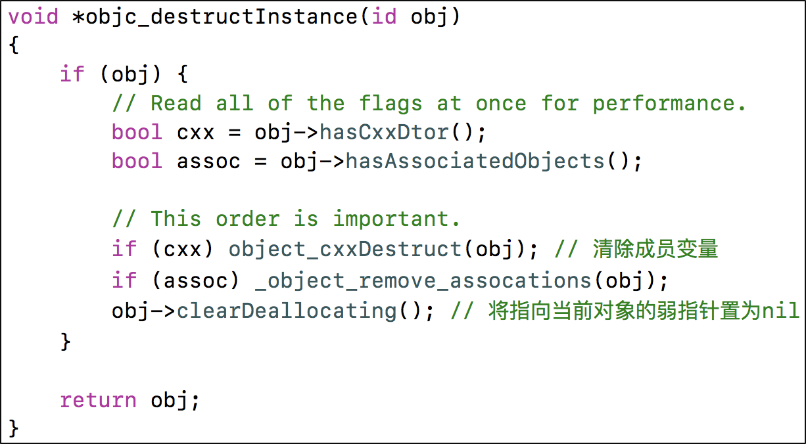

# 内存管理

### 1. 内存布局

<figure><figcaption></figcaption></figure>

代码段：编译之后的代码

数据段

* 字符串常量：比如NSString \*str = @"123"
* 已初始化数据：已初始化的全局变量、静态变量等
* 未初始化数据：未初始化的全局变量、静态变量等

堆区

通过alloc、malloc、calloc等动态分配的空间，分配的内存空间地址越来越大

栈区

函数调用开销，比如局部变量。分配的内存空间地址越来越小

### 2. Tagged Pointer

从64bit开始，iOS引入了Tagged Pointer技术，用于优化NSNumber、NSDate、NSString等小对象的存储

在没有使用Tagged Pointer之前， NSNumber等对象需要动态分配内存、维护引用计数等，NSNumber指针存储的是堆中NSNumber对象的地址值

使用Tagged Pointer之后，NSNumber指针里面存储的数据变成了：Tag + Data，也就是将数据直接存储在了指针中

当指针不够存储数据时，才会使用动态分配内存的方式来存储数据

objc\_msgSend能识别Tagged Pointer，比如NSNumber的intValue方法，直接从指针提取数据，节省了以前的调用开销

### 3. 内存管理

在iOS中，使用引用计数来管理OC对象的内存

一个新创建的OC对象引用计数默认是1，当引用计数减为0，OC对象就会销毁，释放其占用的内存空间

调用retain会让OC对象的引用计数+1，调用release会让OC对象的引用计数-1

* 当调用alloc、new、copy、mutableCopy方法返回了一个对象，在不需要这个对象时，要调用release或者autorelease来释放它
* 想拥有某个对象，就让它的引用计数+1；不想再拥有某个对象，就让它的引用计数-1

copy和mutableCopy

| 
 
         | copy                          | mutableCopy                          |
| ------------------- | ----------------------------- | ------------------------------------ |
| NSString            | 
NSString

浅拷贝
     | 
NSMutableString

深拷贝
     |
| NSMutableString     | 
NSString

深拷贝
     | 
NSMutableString

深拷贝
     |
| NSArray             | 
NSArray

浅拷贝
      | 
NSMutableArray

深拷贝
      |
| NSMutableArray      | 
NSArray

深拷贝
      | 
NSMutableArray

深拷贝
      |
| NSDictionary        | 
NSDictionary

浅拷贝
 | 
NSMutableDictionary

深拷贝
 |
| NSMutableDictionary | 
NSDictionary

深拷贝
 | 
NSMutableDictionary

深拷贝
 |

dealloc

当一个对象要释放时，会自动调用dealloc，接下的调用轨迹是

* dealloc
* \_objc\_rootDealloc
* rootDealloc
* object\_dispose
* objc\_destructInstance、free

<figure><figcaption></figcaption></figure>

自动释放池

自动释放池的主要底层数据结构是：\_\_AtAutoreleasePool、AutoreleasePoolPage

调用了autorelease的对象最终都是通过AutoreleasePoolPage对象来管理的

<figure><figcaption></figcaption></figure>

* 每个AutoreleasePoolPage对象占用4096字节内存，除了用来存放它内部的成员变量，剩下的空间用来存放autorelease对象的地址
* 所有的AutoreleasePoolPage对象通过双向链表的形式连接在一起

<figure><figcaption></figcaption></figure>

* 调用push方法会将一个POOL\_BOUNDARY入栈，并且返回其存放的内存地址
* 调用pop方法时传入一个POOL\_BOUNDARY的内存地址，会从最后一个入栈的对象开始发送release消息，直到遇到这个POOL\_BOUNDARY
* id \*next指向了下一个能存放autorelease对象地址的区域 &#x20;

### 4. Runloop和Autolease的关系

iOS在主线程的Runloop中注册了2个Observer

* 第1个Observer监听了kCFRunLoopEntry事件，会调用objc\_autoreleasePoolPush()
* 第2个Observer
  * 监听了kCFRunLoopBeforeWaiting事件，会调用objc\_autoreleasePoolPop()、objc\_autoreleasePoolPush()
  * 监听了kCFRunLoopBeforeExit事件，会调用objc\_autoreleasePoolPop()

### 5. 总结

* 使用CADisplayLink、NSTimer有什么注意点？

* 介绍下内存的几大区域

* 讲一下你对 iOS 内存管理的理解

* ARC 都帮我们做了什么？
* LLVM和Runtime

* weak指针的实现原理

* autorelease对象在什么时机会被调用release

* 方法里有局部对象， 出了方法后会立即释放吗

